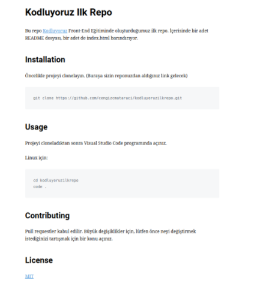

# Kodluyoruz İlk Repo

Bu repo [Kodluyoruz](https://www.kodluyoruz.org/) Front-End Eğitiminde oluşturduğumuz ilk repo. İçerisinde bir adet README dosyası, bir adet index.html barındırıyor.

#Installation
Öncelikle projeyi clonelayın.

git clone https://github.com/Tubanur/kodluyoruzrepo.git

#Usage
Projeyi cloneladıktan sonra Visual Studio Code programında açınız.

Linux için;
cd kodluyoruzrepo
code .

#Contributing
Pull requestler kabul edilir. Büyük değişiklikler için, lütfen önce neyi değiştirmek istediğinizi tartışmak için bir konu açınız.

#License

[MIT](...)

***Tuğbanur Büte***

*Regards*

| Ürün numarası| Ürün açıklaması|
| :----------- | -------------: |
| 1 | Güzel |

